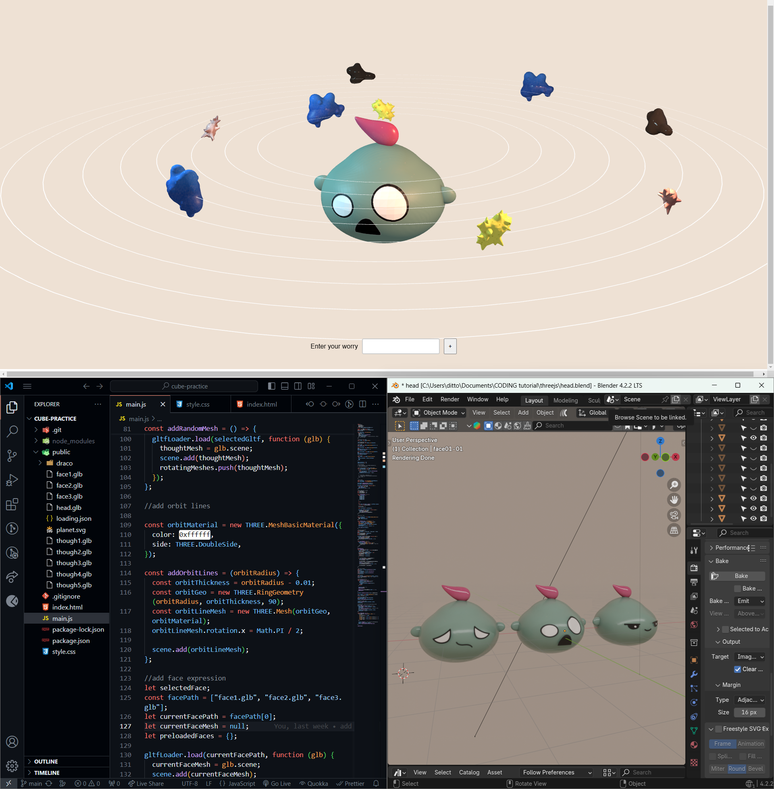

<h1>Shuffle Your Worries</h1>

  

## Introduction

Everyone can feel pressure and worry during these uncertain times, with so much going on in the outside world. I thought: Why not turn this “mind swirl” into a web app to help people untangle their inner world of overloaded thoughts—and maybe even have a laugh about it?

## Live Demo

https://shuffle-your-worries.netlify.app/
 

## Built With

With my background and passion in 3D modeling and web development, I’m using Three.js to implement interactive 3D visualizations that bring this concept to life.

All models are created in Blender, my favorite tool—like the spiky or slimy thought blobs spinning around your head or the worried little face. Always remember to add a bit of humor and a warm human touch to the technology.

### Process

  

## Future Improvement

1. Attach an information board to each "worry blob" to store the details (user data, full-stack)
2. Add more "worry blob" with different texture and shape
